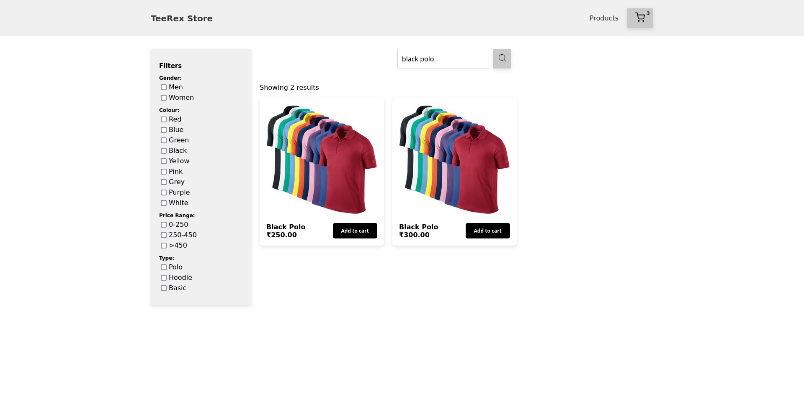

# Teerex Store - ReactJS eCommerce Project

Welcome to Teerex Store! This project is a ReactJS-based eCommerce application designed to showcase a few features typically found in online stores.

## Getting Started

To get started with Teerex Store on your local machine, follow these steps:

### Prerequisites

Make sure you have the following installed:
- Node.js (v20.14.0 or later)
- npm (v10.7.0 or later)

### Installation

- Clone the repository from GitHub:
  ```bash
  git clone https://github.com/your-username/teerex-store.git
  ```
- Navigate into the project directory:
  ```bash
  cd teerex-store
  ```
- Install dependencies using npm or yarn:
  ```bash
  npm install
  # or
  yarn install
  ```

### Running the Application

Once you have installed the dependencies, you can run the application locally:

```bash
npm start

# or

yarn start
```

This command starts the development server and opens the Teerex Store in your default web browser. You can view the app by navigating to http://localhost:5173 in your browser.

## Features

- Product Catalog: Browse a variety of products available for purchase.
- Shopping Cart: Add and remove items from your cart.
- Responsive Design: Ensure a seamless experience across different devices.

## Screenshots

Here are some screenshots of the Teerex Store application:

### Product Catalog




### Shopping Cart


## Technologies Used

- ReactJS: Front-end JavaScript library for building user interfaces.
- React Router: Declarative routing for React applications.
